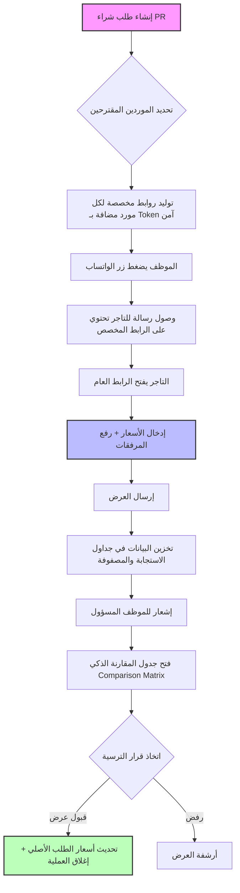

# وثيقة تصميم نظام عروض الأسعار الخارجية (Final Architecture)

## 1. الهدف من النظام
أتمتة عملية جمع عروض الأسعار من الموردين (Merchants) المرتبطين بطلبات الشراء، لتقليل الإدخال اليدوي وتسهيل عملية المقارنة والترسية.

---

## 2. هيكلية قاعدة البيانات (Database Schema)

لتحقيق كفاءة عالية وتجنب تكرار البيانات (Data Redundancy)، تم الاتفاق على الهيكل التالي:

### أ. التعديلات على الجداول الحالية (`purchase_requisitions`):
- إضافة عمود `token`: رمز فريد لتأمين روابط الوصول الخارجية.
- إضافة عمود `quotation_deadline`: تاريخ انتهاء موعد تقديم العروض.

### ب. جدول استجابة الموردين (`purchase_quotation_responses`):
يخزن البيانات العامة لكل عرض سعر مستلم من مورد معين:
- `id`: مفتاح أساسي.
- `purchase_requisition_id`: ربط بطلب الشراء الأصلي.
- `vendor_id`: معرف المورد (من جدول `partner_institutions`).
- `total_amount`: إجمالي مبلغ العرض.
- `currency_id`: العملة المستخدمة.
- `notes`: ملاحظات المورد العامة.
- `attachments`: مسارات الملفات المرفوعة (عروض رسمية).
- `status`: حالة العرض (قيد المراجعة، مقبول، مرفوض).

### ج. جدول مصفوفة الأسعار (`purchase_quotation_prices`):
يخزن السعر المقدم لكل صنف، لتجنب تكرار وصف الأصناف:
- `id`: مفتاح أساسي.
- `quotation_response_id`: ربط بسجل الاستجابة (ب).
- `purchase_requisition_item_id`: ربط بالصنف الأصلي في طلب الشراء.
- `offered_price`: السعر الذي قدمه المورد لهذا الصنف تحديداً.
- `vendor_item_notes`: ملاحظات المورد على الصنف (مثلاً: توفر بديل).

---

## 3. آلية العمل (Workflow)

### مخطط التدفق (Flow Diagram)

---

### الخطوات التفصيلية:
1.  **المرحلة الداخلية**: يقوم الموظف بإنشاء طلب شراء وتحديد الموردين المقترحين (`suggested_vendor_ids`).
2.  **توليد الروابط**: يقوم النظام بتوليد روابط مخصصة لكل مورد (URL يحتوي على Token + Vendor ID).
3.  **الإرسال**: يتم إرسال الروابط عبر الواتساب أو البريد للموردين.
4.  **تعبئة الأسعار**: يفتح المورد الرابط، يرى قائمة الأصناف، يدخل أسعاره، ويرفع عرضه الرسمي.
5.  **المقارنة والترسية**: تظهر العروض في لوحة التحكم في "جدول مقارنة" (Comparison Matrix)، ويقوم المسؤول باختيار العرض الأنسب بضغطة زر.

---

## 4. المميزات التقنية المخطط لها
- **التكامل مع الواتساب (WhatsApp Integration)**: 
    - إضافة زر "إرسال عبر واتساب" بجانب كل مورد في قائمة "التجار المقترحين".
    - عند الضغط عليه، يتم فتح الواتساب برسالة مجهزة مسبقاً تشمل اسم المورد، وصف الطلب، والرابط المخصص له.
    - نص الرسالة المقترح: "عزيزي (اسم التاجر)، تود مؤسسة (الاسم) الحصول على عرض سعر لـ (الوصف). يمكنك إدخال أسعاركم مباشرة عبر الرابط التالي: (الرابط المخصص)."
- **تحديد صلاحية الرابط (Deadline Control)**: 
    - يتم إغلاق الرابط تلقائياً فور تجاوز تاريخ `quotation_deadline`.
    - يمكن للموظف إعادة فتح الرابط عن طريق تمديد التاريخ فقط، دون الحاجة لتغيير الرابط.
- **كود التحقق السري (Quotation PIN Code)**:
    - لكل مورد كود PIN فريد مكون من 4 أرقام يتم توليده برمجياً.
    - **حماية البيانات السابقة**: لا يمكن للمورد الاطلاع على عروضه السابقة أو تحميلها إلا بعد إدخال الـ PIN، لضمان خصوصية الأسعار.
- **سجل العروض وتصدير PDF**:
    - نظام تتبع يتيح للمورد مراجعة كافة عروضه السابقة لنفس الطلب مع إمكانية تحميلها بصيغة PDF.
- **لوحة المقارنة والترسية المالية (Financial Decision Dashboard)**:
    - صفحة مخصصة للمدير المالي توفر مصفوفة مقارنة لونية ذكية بين كافة الموردين.
    - نظام تحديد تلقائي لأقل الأسعار (Green-lighting) لتسهيل اتخاذ القرار.
    - **منطق الترسية (Awarding Logic)**: عند اعتماد مورد، يتم آلياً:
        1. تحديث حالة العرض المختار إلى "مقبول".
        2. تحديث حالة طلب الشراء الأصلي إلى "تمت الترسية".
        3. استبدال الميزانية التقديرية بالمبلغ الحقيقي المعتمد للمقارنة المالية الدقيقة.
- **تحديث الأسعار التلقائي**: عند قبول عرض سعر، يتم تحديث الأسعار التقديرية في الطلب الأصلي بناءً على العرض المقبول.
- **دعم العملات**: التحويل الآلي بين الشيكل والدولار بناءً على سعر الصرف اللحظي للمقارنة العادلة.
- **الأرشفة**: بقاء عروض الأسعار التاريخية لكل طلب شراء للرجوع إليها مستقبلاً.

عند الضغط على زر "ترسية العرض"، يقوم النظام بسلسلة من العمليات البرمجية لضمان تحويل "طلب الشراء" من مرحلة التقديم إلى مرحلة "الترسية والتعميد" الفعلية. إليك ما يحدث بالتفصيل:

1. تحديد الفائز (Selecting the Winner)
يتم تغيير حالة العرض الذي اخترته إلى "مقبول" (Accepted).
يقوم النظام تلقائياً بإلغاء أي ترسية سابقة لنفس طلب الشراء (لضمان وجود فائز واحد فقط في كل مرة).
2. تحديث طلب الشراء الأصلي (Updating the PR)
تحديث الحالة: تتغير حالة طلب الشراء (Purchase Requisition) تلقائياً لتصبح "تمت الترسية/معتمد" (Awarded).
تحديث الميزانية: يتم استبدال "المبلغ التقديري" الذي وضعه الموظف في البداية بـ "المبلغ الحقيقي" الذي قدمه التاجر الفائز. هذا يساعدك لاحقاً في التقارير المالية لمعرفة الفارق بين التقدير والواقع.
3. التوثيق (Audit & Feedback)
تظهر "شارة الفوز" (Winner Badge) بجانب اسم المورد في مصفوفة المقارنة.
تظهر بطاقة ملونة في الجانب تحتوي على كافة بيانات المورد الفائز وقيمة العقد النهائي للرجوع إليها بسرعة.
تصلك رسالة تأكيد خضراء أسفل الشاشة تخبرك بـ "تم ترسية العرض بنجاح".
بمعنى آخر: هذا الزر هو "القرار النهائي" الذي يغلق باب المنافسة ويحول الأرقام الورقية إلى التزام مالي حقيقي تجاه المورد المختار.

خطة تنفيذ نظام عروض الأسعار الخارجية (Quotation System)
المرحلة الأولى: تجهيز قاعدة البيانات والموديلات (Database & Models)
إنشاء الميجرشن (Migration):
إضافة token و quotation_deadline لجدول purchase_requisitions.
إنشاء جدول purchase_quotation_responses (رأس العرض).
إنشاء جدول purchase_quotation_prices (الأسعار لكل صنف).
إنشاء الموديلات (Models):
إنشاء موديول PurchaseQuotationResponse مع علاقة belongsTo مع المورد ومع طلب الشراء.
إنشاء موديول PurchaseQuotationPrice مع علاقة مع الاستجابة ومع بند طلب الشراء.
المرحلة الثانية: المنطق البرمجي والروابط (Logic & Routes)
توليد التوكن (Token Generation): إضافة Observer أو وظيفة داخل الموديول لتوليد token فريد تلقائياً عند إنشاء طلب شراء جديد.
مسارات الروابط (Routes):
مسار عام (Public) مثل: /q/{token}/{vendor_id} لعرض صفحة تقديم السعر.
مسار لحفظ البيانات المرسلة من التاجر.
المرحلة الثالثة: واجهة المورد (Public Vendor Interface)
بناء المكون (Livewire Component): إنشاء مكون PublicQuotation للتعامل مع التاجر.
التصميم (UI/UX):
عرض شعار المؤسسة وبيانات الطلب.
جدول أنيق يعرض الأصناف (الاسم والكمية فقط).
حقول إدخال للأسعار والملاحظات لكل صنف.
منطقة لرفع ملف العرض الرسمي (PDF/Images).
المرحلة الرابعة: لوحة تحكم الإدارة (Management UI)
إدارة عروض الأسعار: إضافة تبويب "عروض الأسعار" داخل شاشة عرض طلب الشراء.
التكامل مع الواتساب (WhatsApp Integration):
إضافة زر بجانب كل مورد مقترح.
برمجة وظيفة تفتح رابط الواتساب بالرسالة المجهزة والرابط المخصص.

- **مركز إدارة الردود (Quotation Management Center)**: إنشاء صفحة إدارية كاملة تتيح للموظف تصفح كافة الردود الواصلة من جميع الموردين، مع إمكانية الفلترة والمعاينة التفصيلية لكل عرض (الأصناف، الأسعار، والمرفقات).
- **جدول المقارنة (Comparison Matrix)**: بناء عرض (View) داخل تفاصيل الطلب يعرض التجار جنباً إلى جنب مع أسعارهم لكل صنف لتسهيل الاختيار.
المرحلة الخامسة: الترسية والتحقق (Finalization)
عملية القبول: إضافة وظيفة لاعتماد عرض سعر معين، والتي تقوم بتحديث حالة الطلب وتثبيت الأسعار النهائية.
نظام التنبيهات: إرسال إشعارات داخلية عند وصول عرض سعر جديد.

---

## 5. الهيكل البرمجي والملفات (File Structure & Routes)

للمراجعة التقنية، تم إنشاء وتعديل الملفات التالية:

### أ. المسارات (Routes)
- **رابط المورد العام**: `/q/{token}/{vendor_id}` (الاسم: `quotation.public`).
- **مركز إدارة الردود (Index)**: `/dashboard/quotations` (الاسم: `quotation.index`).
- **معاينة عرض سعر (Show)**: `/dashboard/quotations/{id}` (الاسم: `quotation.show`).

### ب. قاعدة البيانات (Migrations)
- `database/migrations/2026_04_24_104230_add_quotation_fields_to_purchase_requisitions.php`
- `database/migrations/2026_04_24_104232_create_purchase_quotation_responses_table.php`
- `database/migrations/2026_04_24_104233_create_purchase_quotation_prices_table.php`

### ج. النماذج (Models)
- `App\Models\PurchaseQuotationResponse.php`: رأس عرض السعر.
- `App\Models\PurchaseQuotationPrice.php`: مصفوفة أسعار الأصناف.
- `App\Models\PurchaseRequisition.php`: (تعديل) منطقية التوكن، الـ PIN، والعلاقات.
- `App\Models\PurchaseRequisitionItem.php`: (تعديل) علاقة أسعار العروض.

### د. مكونات Livewire
- **واجهة المورد (خارجية)**:
    - `App\Livewire\OrgApp\PurchaseRequest\PublicQuotation.php`
    - `resources/views/livewire/org-app/purchase-request/public-quotation.blade.php`
- **مركز الإدارة والردود (داخلي - صفحات كاملة)**:
    - `App\Livewire\OrgApp\PurchaseRequest\QuotationIndex.php`: عرض كافة الردود مع الفلترة.
    - `App\Livewire\OrgApp\PurchaseRequest\QuotationShow.php`: معاينة تفصيلية للمرفقات والأسعار.
- **واجهة طلب الشراء (تعديلات)**:
    - `App\Livewire\OrgApp\PurchaseRequest\Index.php`: (دالة الترسية وتحميل البيانات).
    - `resources/views/livewire/org-app/purchase-request/index.blade.php`: (مصفوفة المقارنة وأزرار الواتساب).
    - `resources/views/layouts/app/sidebar.blade.php`: (إضافة رابط القائمة الجانبية).